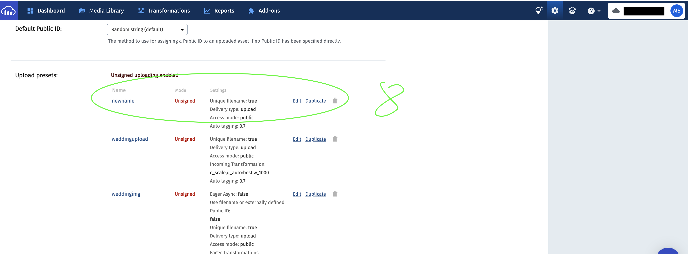
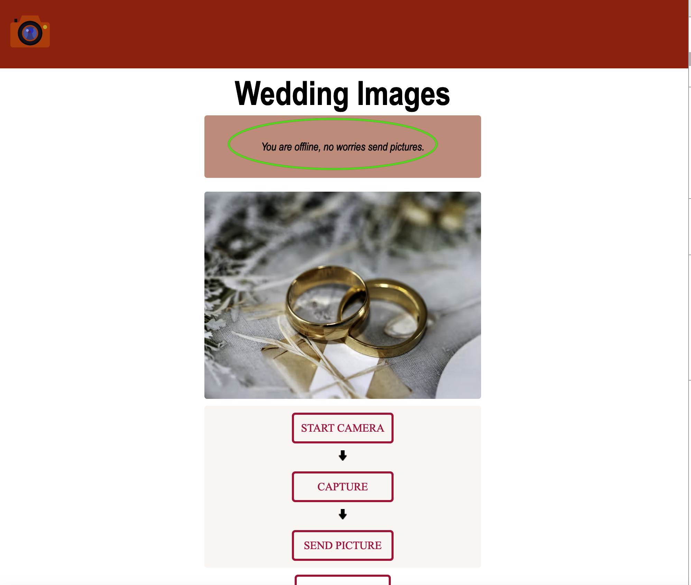
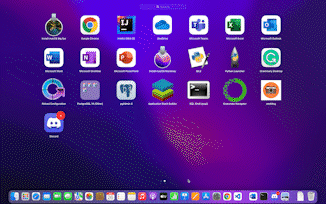

# Progressive web app
# Wedding Pictures

This is a wedding pictures app where each user submits pictures of the bride and groom. This app catches caches using service worker and next js PWA, so it works both online and offline. The users can see pictures and upload pictures even if there is no internet connection.

this app can be installed as a native app, on android, ios and desktops

this app displays 10 pics on screen a user can press the button down to road more pictures.

## HOME

This App is progressive web app (PWA)
   

Image capture (Live App)
   

pop up app installation (Live App)
   

ask if you are sure to install(Live App)
   

Install on the phone (Live App)
   

## Quick Start
### installation

## to run this app locally
1. download or clone github repo

2. got to cloudinary and signup
   - create account on cloudinary [cloudinary](https://cloudinary.com/)
   - follow the step bellow

   1. signup to cloudinary.

   

   2. go to setting in up right corner --> upload.
   

   3. add upload preset.
   

   4. choose name of your choice --> set signing mode to unsigned.

   

   5. result will be like this.

   

   6.Go to dashbord copy credential.

   

   7. create a file `.env.local` into your root add credential in env file.

   

3. go to src--> components -->ClCamera --> index.js and add your cloudinary name and upload preset name like this:

    

4. run `npm install`
5. run `npm run build`
6. run `npm run dev`

### Live app
- live app on phone

  

- live app on computer

  

- live app and image model

  

- service worker

  

- offline notification

  

- offline persistance

 

- manifest

 

- installed app on mac

 

- open installed app

 

## Technology
- react [react](https://reactjs.org/)
- nextjs [nextjs](https://nextjs.org/)
- PWA    [PWA](https://web.dev/progressive-web-apps/)
- typescript [typescript](https://www.typescriptlang.org/)
- cloudinary [cloudinary](https://cloudinary.com/)
- framer-motion [framer-motion](https://www.framer.com/motion/)
- sass [scss](https://sass-lang.com/documentation/syntax)

## Test

This app was tested on macbook pro 2019
and iphone 12
### Test on real Camera

 

 -----------------------------------

### test on front camera

 

 -----------------------------------

### test for offline notification

 

 -----------------------------------

### test for permission notification

------------------------------------

### test offline persistance(pwa)

------------------------------------

