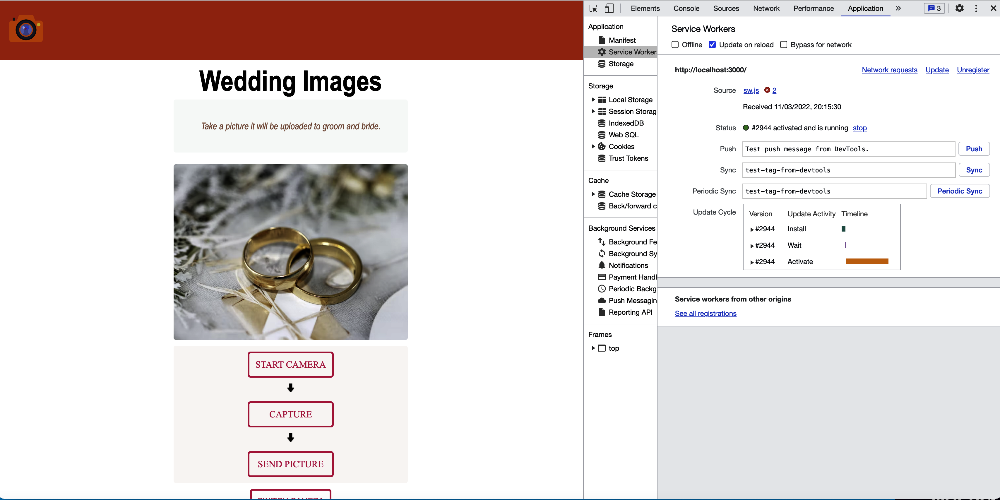
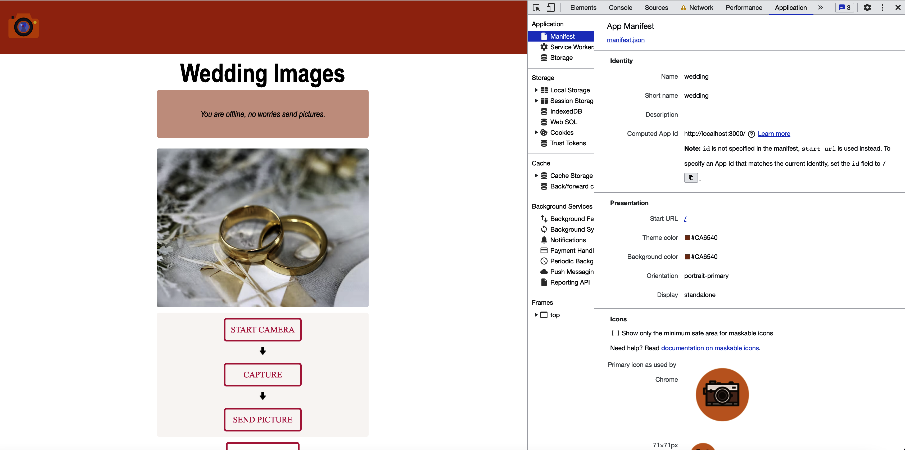

# Wedding Pictures

This is a wedding pictures app where each user submits pictures of the bride and groom. This app catches caches using service worker and next js PWA, so it works both online and offline. The users can see pictures and upload pictures even if there is no internet connection.

this app can be installed as a native app, on android, ios and desktops

this app displays 10 pics on screen a user can press the button down to road more pictures.

## Quick Start
### installation

## to run this app locally
1. download or clone github repo

2. got to cloudinary and signup
   - create account on cloudinary [cloudinary](https://cloudinary.com/)
   - follow the step bellow

   1. signup to cloudinary.

   

   2. go to setting in up right corner --> upload.
   

   3. add upload preset.
   

   4. choose name of your choice --> set signing mode to unsigned.

   

   5. result will be like this.

   

   6. copy credential and pase in the env file.

   

   7. create a file `.env.local` into your root.

   

3. go to src--> pages --> index.js and add your cloudinary name and upload preset name like this:

    

4. run `npm install`
5. run `npm run build`
6. run `npm run dev`

### Live app

- icon installation

  

- service worker and offline support support

  

- manifest

 

## Technology
- react [react](https://reactjs.org/)
- nextjs [nextjs](https://nextjs.org/)
- PWA    [PWA](https://web.dev/progressive-web-apps/)
- typescript [typescript](https://www.typescriptlang.org/)
- cloudinary [cloudinary](https://cloudinary.com/)
- framer-motion [framer-motion](https://www.framer.com/motion/)
- sass [sass](https://sass-lang.com/)

